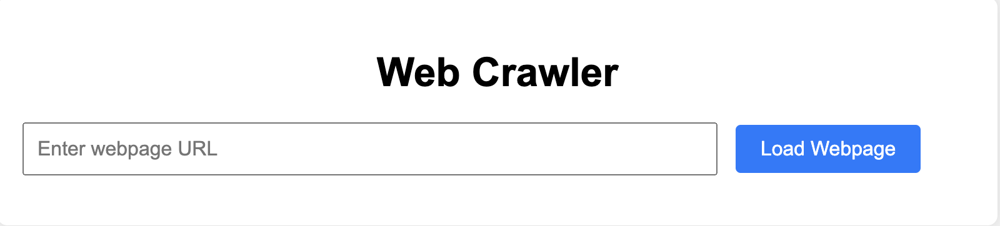
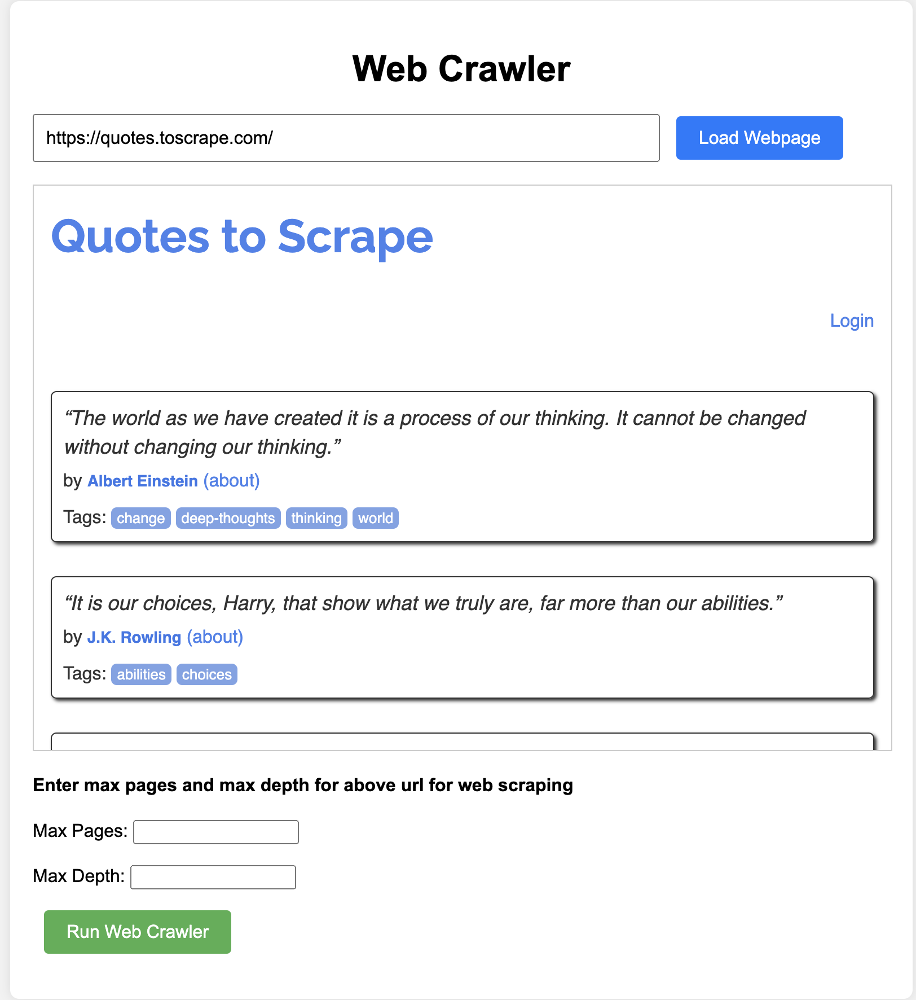
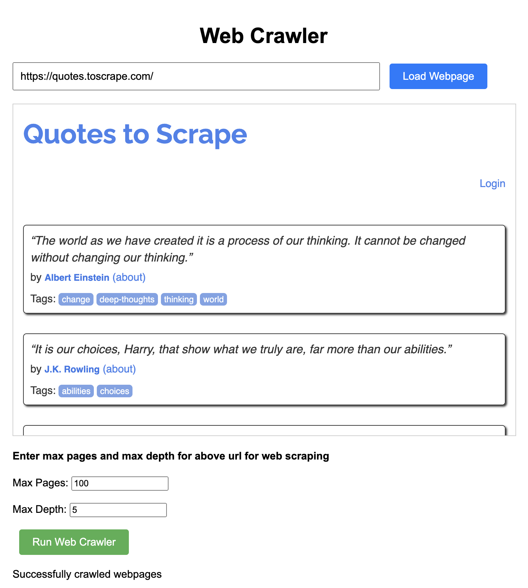
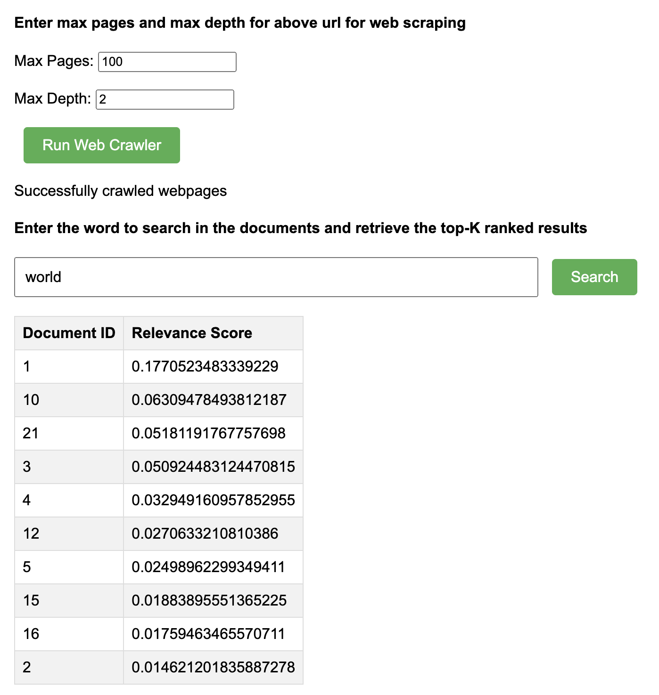
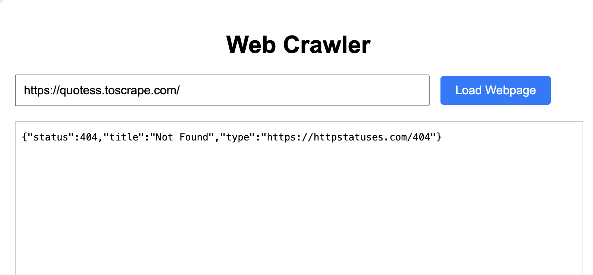
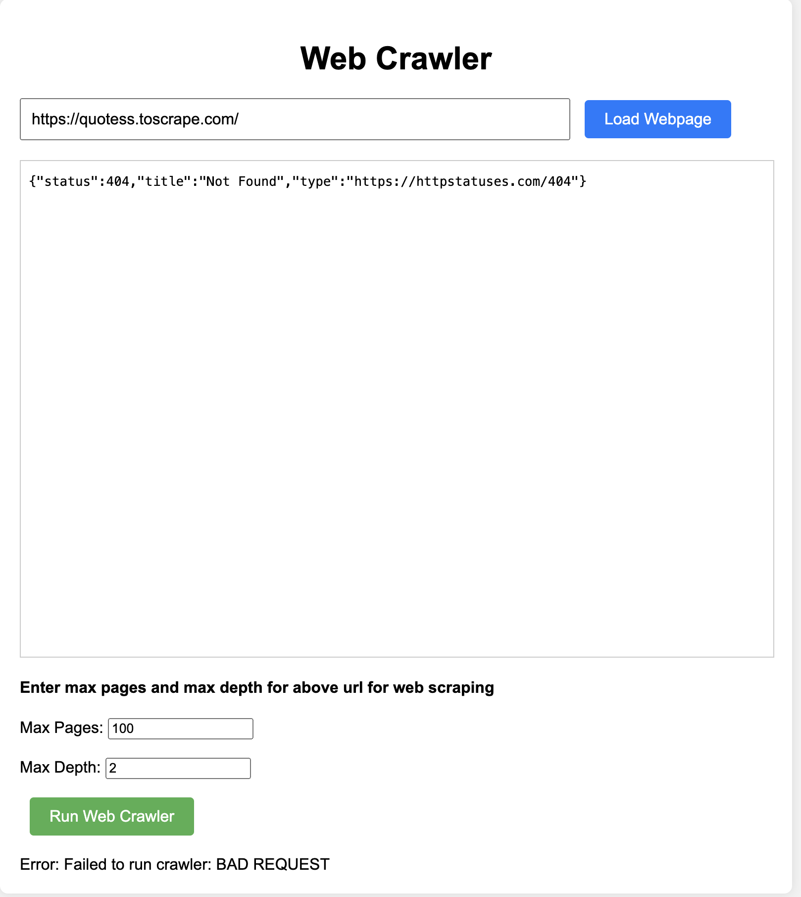

# Web Document Search Engine: A Comprehensive Development Report

#### BY SATWIKA SRIRAM(A20563950)

### ABSTRACT:

This report documents the development of a web document search engine, leveraging the strengths of Scrapy for web crawling, Scikit-learn for inverted indexing, and Flask framework for building web application that facilitates user query processing. The primary goal is to construct a system that empowers the users to load and search a downloaded collection of HTML documents using TF-IDF weighting and cosine similarity for retrieval. We envision further advancements to explore concurrent and distributed crawling techniques, incorporate vector embedding representations for semantic similarity, and integrate query expansion strategies to enhance search comprehensiveness.

### OVERVIEW:

The search engine embarks on a three-pronged approach:

1.	Web Crawling (Scrapy): Scrapy, a robust web scraping framework, meticulously gathers & downloads the HTML documents from a user-designated website. This initial corpus serves as the foundation for subsequent indexing and retrieval tasks.
2.	Inverted Indexing (Scikit-learn): The downloaded HTML documents are meticulously parsed to extract their textual content. Scikit-learn's TF-IDF vectorizer plays a pivotal role in constructing an inverted index. This data structure efficiently stores terms and their occurrences within documents, along with their TF-IDF weights, which quantify a term's significance within a specific document corpus. Furthermore, Scikit-learn's inverted index can be serialized using Pickle, a Python library for saving and loading complex data structures. Pickling the inverted index allows us to persist the indexing process and avoid recomputing it for every new query, significantly improving efficiency.
3.	User Query Processing (Flask): Flask, a lightweight web application framework, forms the backbone of the user interface. Users submit free-text queries through a web interface. The system meticulously processes the query, calculates TF-IDF weights for the query terms, and leverages the cosine similarity metric to evaluate the relevance of indexed documents to the user's query. Finally, the retrieved documents are ranked and presented to the user in descending order of their relevance scores.

### DESIGN:

- ### SYSTEM CAPABILITIES:
    - SCRAPY CRAWLER: The industrious workhorse responsible for diligently fetching HTML documents from the specified website.
    - INVERTED INDEXER: The mastermind behind constructing and maintaining the inverted index, meticulously storing terms, their document occurrences, and their corresponding TF-IDF weights.
    - QUERY PROCESSOR: The ever-courteous interface that interacts with users, processes their queries, calculates document relevance scores, and meticulously returns the most pertinent results.

- ### INTERACTIONS:
    - USER SYSTEM INTERACTION: Users seamlessly interact with the system through a user-friendly web interface crafted with Flask.
    - SCRAPY CRAWLER EXECUTION: The Scrapy crawler can be initiated periodically to update the document corpus by fetching new or updated content from the target website.

- ### INTEGRATION:
    - PERSISTENCE: The inverted index, meticulously constructed by the InvertedIndexer, is preserved in a pickle file, ensuring its persistence across system restarts.
    - INDEX LOADING: At system startup, the Query Processor gracefully loads the pre-built inverted index, enabling it to efficiently process user queries.

### ARCHITECTURE:

- ### SOFTWARE COMPONENTS:
    - Python: The versatile programming language that serves as the foundation for the entire system.
    - Scrapy: The web scraping framework adept at gathering web documents.
    - Scikit-learn: The machine learning library that furnishes the TF-IDF vectorizer for constructing the inverted index.
    - Flask: The web application framework that empowers the creation rest based application.
    - HTML, CSS, Javascript - These tools and frameworks used to build UI interface.

- ### INTERFACES:
    - Flask RESTful API: The user interface leverages a Flask RESTful API to facilitate user queries in JSON format.
    - Scikit-learn's TF-IDF Vectorizer: This Scikit-learn component provides functions for text processing, weighting terms using TF-IDF, and efficiently representing documents as TF-IDF vectors.

- ### IMPLEMENTATION:
    - Scrapy Spider: The meticulously crafted Scrapy spider traverses the target website, downloads HTML documents, and stores them locally.
    - InvertedIndexer: This component meticulously parses the downloaded HTML documents, extracts their textual content, and constructs the inverted index using TF-IDF weighting. The constructed inverted index is then serialized and saved for persistence.
    - Query Processor: The Query Processor intercepts user queries submitted through the Flask interface. It meticulously processes the query, calculates TF-IDF weights for the query terms, performs a cosine similarity calculation against all documents in the loaded inverted index, and finally returns the top-ranked documents along with their corresponding relevance scores.

### OPERATION:

### SOFTWARE COMMANDS:

1) Running the Application:
Navigate to the directory which contains the project files and execute the command "python3 crawlerApp.py" to start the Flask web application.

python3 crawlerApp.py

2) Enter the URL of the website that you want to scrape and click on the button "Load Webpage" to view the contents of the webpage. Using the website "https://quotes.toscrape.com/" to scrap in this case.

3) Enter the max pages and max depth for above url for web scraping and click on the button "Run Web Crawler". Setting the max_pages to 100 and max_depth to 5 for crawling in this case.Each time we perform web crawling, the already downloaded files are deleted in the directory. This ensures accurate data for indexing.

4) At this point, indexer.py is called from the web_indexer folder that implements a simple search engine indexer using TF-IDF (Term Frequency-Inverse Document Frequency) for document indexing and cosine similarity for search retrieval. Additionally, it includes a method "load_html_to_indexer" to load HTML content, extract text from it, and add the extracted text as documents to the indexer.

5) Enter the word to search in the downloaded documents and retrieve the top-K ranked results and click on "Search" to view the documents along with their scores. In this case, searching the downloaded documents with the word "world".

### FAILURE SCENARIOS:

1) If the URL is invalid, we get the below error message.

2) When we try to perform web crawling, we get the below error message so that further steps are not executed.

### CONCLUSION:

Overall, the project achieves success in building a functional web crawling, indexing, and querying system meeting the specified requirements.Generated outputs include downloaded HTML documents, a pickle file containing the inverted index, and JSON responses to user queries.

In the module "Scrapy-based Crawler", the crawler effectively downloads web documents in HTML format based on the provided seed URL/domain, with constraints on maximum pages and depth. It outputs downloaded HTML documents stored locally. However, ensure proper handling of edge cases such as unreachable URLs, infinite loops, or large-scale crawling impacting server loads.

In the module "Scikit-Learn based Indexer", the indexer efficiently builds an inverted index from the downloaded HTML documents, enabling subsequent search functionality. It outputs a pickle file containing the inverted index. However,validate data consistency and handle potential memory constraints when indexing large datasets.

In the module " Flask-based Processor", the processor effectively handles user queries, validates input, and returns relevant search results. It outputs JSON responses containing search results. However, implement robust error handling to gracefully manage invalid queries or unexpected errors during processing.

### DATA SOURCES:

1. Scrapy-based Crawler:
- Purpose: Downloads web documents in HTML format.
- Content Crawling
Required:
Initialize using seed URL/Domain, Max Pages, Max Depth.
- Data Sources:
    - Links: Scrapy Documentation(https://scrapy.org/)
    - Downloads: Install Scrapy via pip (pip3 install scrapy)
    - Access Information: Utilize Scrapy spiders to crawl websites using the command - 
    "scrapy runspider webcrawler.py -a seed_url='{seed_url}' -a max_pages={max_pages} -a max_depth={max_depth}"

2. Scikit-Learn based Indexer:

- Purpose: Constructs an inverted index in pickle format.
- Search Indexing:
Required:
TF-IDF score/weight representation, Cosine similarity.
- Data Sources:
    - Links: Scikit-Learn Documentation(https://scikit-learn.org/)
    - Downloads: Install Scikit-Learn via pip (pip3 install scikit-learn)
    - Access Information: Utilize Scikit-Learn's TF-IDF vectorizer and cosine similarity functions.

3. Flask-based Processor:
- Purpose: Handles free text queries in JSON format.
- Query Processing:
Required:
Query validation/error-checking, Top-K ranked results.
- Data Sources:
    - Links: Flask Documentation(https://flask.palletsprojects.com/)
    - Downloads: Install Flask via pip (pip3 install Flask)
    - Access Information: Set up Flask routes to handle query processing.

### TEST CASES:

Several test cases are executed to test the framework, harness and coverage of the application.

Navigate to the test folder by using the command "cd test" in terminal.

1) Execute "python3 crawlerAppTest.py" to test the routes of a Flask web crawler application:
    - "test_index_route": Tests the index route of the application ("/") to ensure it returns a status code of 200 (OK).
    - "test_run_crawler_invalid_seed_url": Tests the route responsible for running the crawler ("/runcrawler") with invalid seed URL data. It expects a 400 status code indicating a bad request.

2) Execute "python3 extractHTMLTest.py" to test extracting text from HTML content and generating HTML content from file:
    - "test_extract_text_from_html": Tests the extract_text_from_html function, ensuring that it correctly extracts text from HTML content.
    - "test_extract_text_from_html_invalid_content": Tests the handling of invalid HTML content by the extract_text_from_html function.
    - "test_generate_html_content": Tests the generate_html_content function, which generates HTML content from files in a specified directory.
    - "test_generate_html_content_empty_dir": Tests the behavior of generate_html_content when provided with an empty directory.
    - "test_generate_html_content_non_exist_dir": Tests the behavior of generate_html_content when provided with a non-existent directory.

3) Execute "python3 indexerTest.py" to test the functionality of the Indexer class, ensuring that it correctly adds documents, builds an index, saves and loads the index, and performs searches as expected:
    - "test_add_document": Tests the add_document method of the Indexer class, ensuring that documents are correctly added to the indexer.
    - "test_build_index": Tests the build_index method of the Indexer class, verifying that the index is built correctly from HTML documents.
    - "test_save_index": Tests the save_index method of the Indexer class, ensuring that the index is correctly saved to a file using pickle serialization.
    - "test_search": Tests the search method of the Indexer class, verifying that search results are returned as expected.
    - "test_load_html_to_indexer": Tests the load_html_to_indexer method of the Indexer class, ensuring that HTML documents are loaded correctly into the indexer.
 
### SOURCE CODE:

Source code listings, documentation, and dependencies are available in the project repository, adhering to open-source standards.

1) "webcrawler.py":

    This is a Python script using the Scrapy framework to create a web crawler.This Python script implements a web crawler using the Scrapy framework to systematically traverse web pages, retrieve their HTML content, and store it locally. The crawler starts from a specified seed URL and follows links to subsequent pages, with options to limit the number of pages crawled and the depth of traversal. It saves each page's HTML content to individual files in a designated directory. Additionally, it provides error handling to halt crawling when the maximum page limit is reached. Overall, the script offers a customizable solution for gathering web page data for further analysis or processing.

2) "indexer.py":

    This code defines a class called Indexer, which is used for indexing and searching text documents. It utilizes TF-IDF (Term Frequency-Inverse Document Frequency) for vectorizing the documents and cosine similarity for ranking search results. The class provides methods to add documents to the index, build the index, save and load the index from disk, and search for relevant documents based on a query. Additionally, it includes a method load_html_to_indexer to extract text from HTML files and add them to the indexer. This code essentially enables the creation of a search engine capable of retrieving relevant documents based on user queries.

3) "crawlerApp.py":

    This code defines a Flask application for a web crawler and search engine.This code essentially creates a web interface where users can input a seed URL and crawling parameters, initiate the crawling process, and later perform searches on the indexed documents.

    - Flask Web Application: Initializes a Flask app to handle HTTP requests.
    - Indexer Integration: Utilizes an instance of the Indexer class (imported from web_indexer.indexer) to index and search documents. This indexer is populated with data extracted by the web crawler.
    - Routes:
       - '/': Serves an HTML template for the home page.
       - '/runcrawler': Handles POST requests to initiate the web crawling process. It runs a Scrapy spider specified in webcrawler.py to crawl web pages based on parameters like seed URL, maximum pages, and maximum depth. After crawling, it indexes the downloaded HTML content using the Indexer using the command "scrapy runspider webcrawler.py -a seed_url='{seed_url}' -a max_pages={max_pages} -a max_depth={max_depth}".
       - '/search': Processes POST requests containing search queries. It validates the query and retrieves relevant documents using the Indexer, returning the top results.
    - Helper Methods:
       - validate_query: Checks if a search query is valid.
       - search: Uses the Indexer to retrieve relevant documents based on a query.
    - Server Initialization: Opens a browser and starts the Flask app on http://127.0.0.1:5000.

4) "index.html"(templates/index.html):

    This HTML code defines a web interface for the basic web crawler and search engine. It includes input fields for entering a webpage URL, specifying maximum pages and depth for crawling, and entering search queries. JavaScript functions handle loading webpages in iframes, running the web crawler, submitting search queries to the server asynchronously, and displaying search results dynamically without page reloads. Additionally, error handling and feedback messages are provided for user interactions.

### BIBLIOGRAPHY:  

- Scrapy. (n.d.). Retrieved from https://scrapy.org/
- Scikit-learn. (n.d.). Retrieved from https://scikit-learn.org/stable/
- Flask. (n.d.). Retrieved from https://flask.palletsprojects.com/en/2.0.x/
- Pluralsight. (n.d.). Web Scraping with Beautiful Soup. Retrieved from https://www.pluralsight.com/resources/blog/guides/web-scraping-with-beautiful-soup
- HTML. (n.d.). Retrieved from https://html.spec.whatwg.org/multipage/

